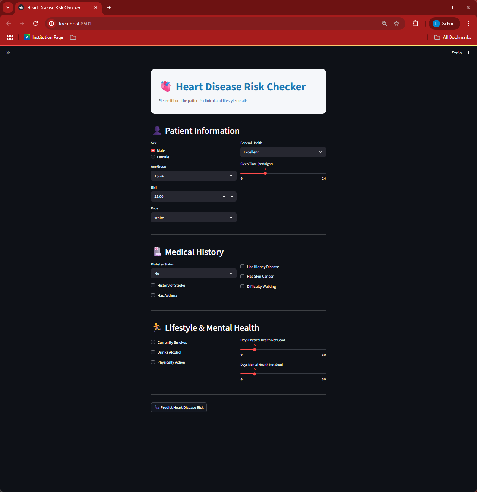

## Heart Disease Risk Checker

A patient-friendly web application that predicts whether a patient is at risk of heart disease based on clinical and lifestyle indicators.
Built with **Streamlit** and powered by a **Random Forest Classifier**, this tool is designed for use by healthcare staff in community clinics.

## Features

- Predicts **Heart Disease Risk** (At Risk / Not at Risk)
- Displays **Confidence Score**
- Clean, user-friendly UI with input sections:
  - 👤 Patient Demographics
  - 🏥 Medical History
  - 🏃 Lifestyle & Mental Health
- Includes **Confusion Matrix** and **ROC Curve** for live input
- Interactive **sidebar** with model info

## Screenshot

## How to Run Locally

1. Clone the repository
2. Install dependencies: pip install -r requirements.txt
3. Run the app:

## Live App
🔗 [Click here to open the live app](https://your-streamlit-app-link.streamlit.app)

## Model Training Notebook
🔗 [View on Google Colab](https://colab.research.google.com/drive/1cdJn7zHDqyjxgfHtTBaGBFow4426DO-o?usp=sharing)